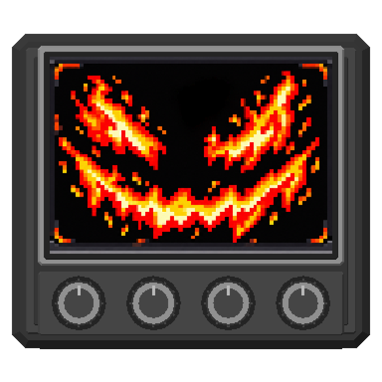
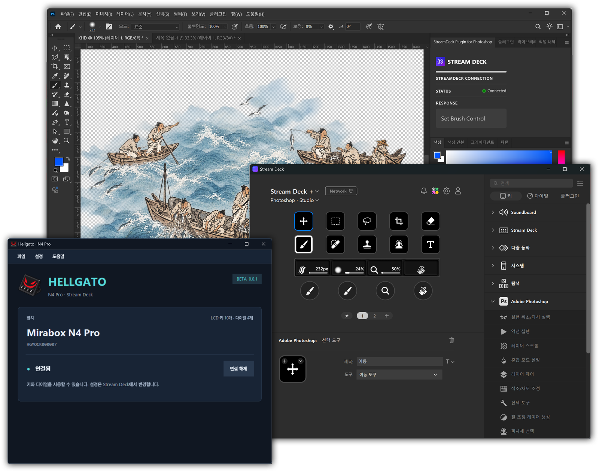
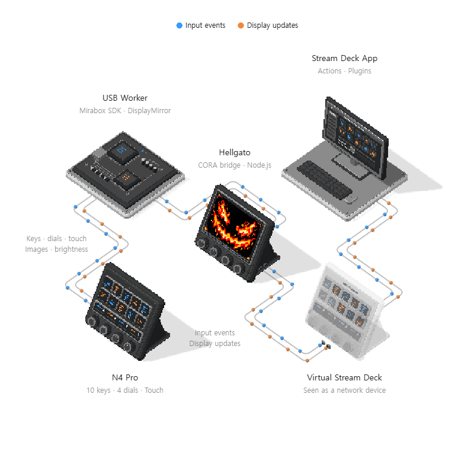

  

<h1 align="center">Hellgato</h1>

  <strong>Unofficial hardware. Official software.</strong>

  <a href="https://github.com/restarea92/hellgato/releases/download/v0.0.5-beta/Hellgato-0.0.5-beta-Setup.exe"><strong>Download for Windows (.exe)</strong></a> ·
  <a href="docs/guide.md">Guide &amp; development</a> ·
  <a href="https://github.com/restarea92/hellgato/issues">Report an issue</a>

Hellgato is an open-source Windows bridge that brings third-party hardware into the official Elgato Stream Deck app. Configure your actions, profiles and plugins in Stream Deck; Hellgato connects them to your hardware.

**Plug in your hardware. Put Stream Deck to work.**

  

## Supported devices

| Device | Controls | Platform | Status |
| --- | --- | --- | --- |
| Mirabox N4 Pro (stock firmware) | 10 LCD keys, 4 dials | Windows x64 | ✅ Tested — supported in the current beta |

**Version:** `0.0.5-beta`. Currently supports one connected N4 Pro. Other devices have not been validated. Remaining hardware checks are listed below.

## Get started

**[Download the Windows installer](https://github.com/restarea92/hellgato/releases/download/v0.0.5-beta/Hellgato-0.0.5-beta-Setup.exe)** — download the `.exe` file and run it. No source code or build tools needed.

1. Install the official [Stream Deck app](https://www.elgato.com/downloads).
2. Download and run the [Hellgato Windows installer](https://github.com/restarea92/hellgato/releases/download/v0.0.5-beta/Hellgato-0.0.5-beta-Setup.exe).
3. Connect your N4 Pro over USB and open Hellgato.
4. In Stream Deck, open **Network** and connect to `127.0.0.1:5343` on first use.

The installer bundles the runtimes and USB SDK. No StreamDock required. Install any extra Stream Deck plugins separately.

## How it works

Hellgato presents your N4 Pro as a network-connected Stream Deck. The official app runs your actions and plugins and sends display updates back to the hardware.

  

**Blue** carries key, dial and touch input toward the app. **Orange** carries key images, touch-screen updates and brightness toward the device. The translucent **Virtual Stream Deck** represents the device identity exposed by CORA.

The Python USB worker combines the **Mirabox SDK** for hardware communication with **DisplayMirror** for screen updates. It sends input commands to the Node.js **CORA bridge** through `stdin` and reads returning images and events from JPEG files and JSONL. CORA communicates with Stream Deck over local TCP: `127.0.0.1:5343` for pairing and `127.0.0.1:5344` for input and display traffic.

DisplayMirror merges repeated updates to the same key or touch region within each batch. In the default frame mode, it sends only the updated touch-strip region after the initial frame, reducing redundant USB work.

## Everyday essentials

- **Your setup travels.** Export profiles as a `.hellgatoProfiles` bundle (`Ctrl+E`), or import bundles and `.streamDeckProfile` files (`Ctrl+I`). Imports back up replaced profiles and restart Stream Deck.
- **Close the window. Keep the buttons.** Hellgato stays in the tray; use its menu to exit.
- **Make yourself at home.** Eleven interface languages, plus optional startup at Windows sign-in.

Need logs, backup locations or build instructions? They're in the [guide](docs/guide.md).

## Beta notes

The installer is unsigned. Compatibility has been validated with **Stream Deck 7.6.0.23012**; later releases may need updates.

Ten-key support and touch strip feedback scheduling temporarily adjust the running Stream Deck process's memory; the executable on disk stays unchanged. Using a genuine Stream Deck + at the same time is outside this beta's scope. Some dial, touch, animation and reboot behavior still needs hardware testing.

Found an issue? [Let us know](https://github.com/restarea92/hellgato/issues) with your device, Stream Deck version and steps to reproduce it. Review logs and exported profiles for personal information before sharing.

## TODO

- [ ] Validate dial release and hold behavior, touch alignment, and sustained animations.
- [ ] Verify recovery after Windows reboots and extended use.
- [ ] Expand testing across Stream Deck versions and additional hardware.
- [ ] Review interface translations with native speakers.

Longer term: explore a shared Rust core and macOS support, after the Windows beta is more settled.

## Contributing

Bug fixes, hardware reports and translation polish are welcome. See the [contributor guide](docs/guide.md#contributing), browse the [language files](app/locales), or send [translation feedback](https://github.com/restarea92/hellgato/issues/new?template=translation.yml).

For device developers, the [Node bridge API](packages/core) is available as `hellgato@beta` and `@hellgato/core@beta`. Both share the desktop app's bridge implementation; USB adapters and Windows compatibility adjustments remain separate.

## License

[MIT](LICENSE). Bundled dependencies keep their own licenses; see [third-party notices](installer/THIRD-PARTY-NOTICES.txt).

Hellgato is an independent project, not affiliated with or endorsed by Elgato or Mirabox.
