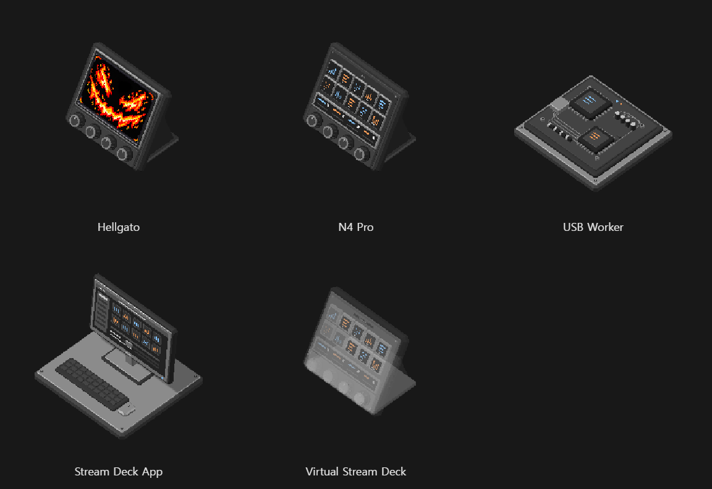

# Device assets

Self-contained glTF 2.0 binary models from the Hellgato architecture scene. Each GLB contains its geometry, materials, and embedded screen textures. Models use a shared Y-up orientation and a local origin at the footprint center. Dimensions are illustration units.

| File | Model |
| --- | --- |
| [hellgato.glb](hellgato.glb) | Black controller with a flame face and four dials |
| [n4-pro.glb](n4-pro.glb) | Black N4 Pro with ten keys, a touch strip, and four dials |
| [usb-worker.glb](usb-worker.glb) | Mirabox SDK and DisplayMirror circuit-board illustration |
| [stream-deck-app.glb](stream-deck-app.glb) | App monitor, keyboard, mouse, and platform |
| [virtual-stream-deck.glb](virtual-stream-deck.glb) | Translucent device identity exposed by CORA to the app |

Hellgato, N4 Pro, and Virtual Stream Deck have no separate floor platform. Their integral device stands remain. The virtual device represents how the app recognizes Hellgato; it is not an additional physical device or process.

The pixel appearance comes from rendering the 3D objects at low resolution and enlarging them with nearest-neighbor filtering. [render-settings.json](render-settings.json) records the camera, lighting, texture filtering, and preview settings. Wires, moving packets, labels, ground shadows, and rendering-only occlusion proxies are excluded from the GLBs.

[manifest.json](manifest.json) records file hashes, geometry counts, bounds, embedded texture counts, alpha values, and the original diagram positions. All five files were reloaded with Three.js GLTFLoader and checked for matching geometry, bounds, textures, and transparency. The flame screen retains its UV crop and unlit material.

Transparent PNG previews are in [previews](previews/).

